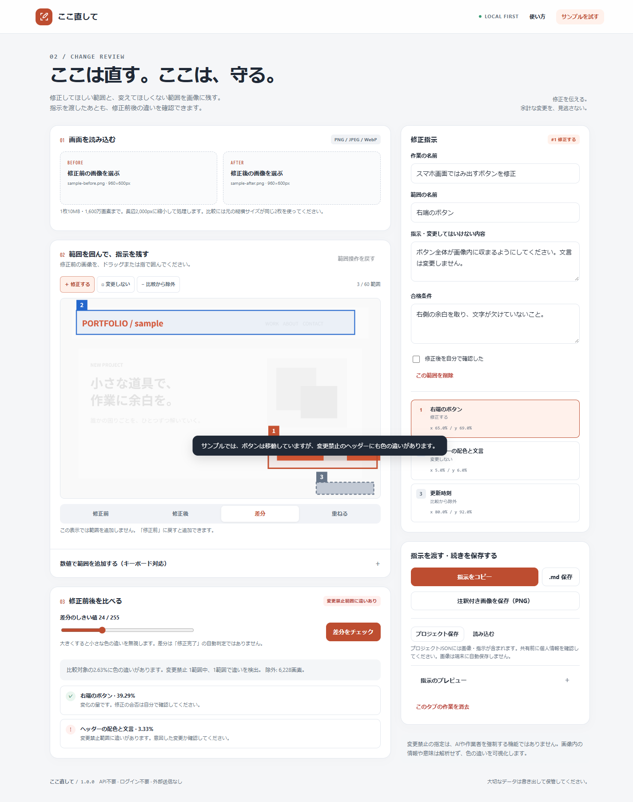

# ここ直して

スクリーンショットに「修正する」「変更しない」「比較から除外」の範囲を記録し、修正指示と合格条件をまとめるローカルWebアプリです。修正後の画像を重ねて、守りたい場所の変化を確認できます。

**外部サービスのAPI不要 · ログイン不要 · 有料サーバー不要 · ビルド不要**



**[ブラウザで開く](https://masanori-spec.github.io/koko-naoshite/)** · [ソースコード](https://github.com/Masanori-Spec/koko-naoshite)

## できること

- PNG・JPEG・WebP画像を、外部に送信せず読み込み。
- マウス・タッチによる範囲指定と、キーボードで操作できる座標入力。
- 修正範囲、変更禁止範囲、時計などを比較から外す除外範囲。
- 範囲ごとの修正指示・合格条件・手動確認と、範囲操作の取り消し。
- 同じ縦横サイズの画像について、色差しきい値を使った比較、ヒートマップ、重ね合わせ。
- 注釈付きPNG、指示書Markdown、画像と指示を含むプロジェクトJSONの書き出し・復元。

## 使い方

1. 「サンプルを試す」で、3種類の範囲と比較結果を確認します。
2. 修正前の画像を読み込み、範囲を囲んで指示・合格条件を入力します。
3. 指示書と注釈付きPNGを保存し、普段使う制作ツールに渡します。このアプリからAIは呼び出しません。
4. 同じ撮影条件・元の縦横サイズの修正後画像を読み込み、比較します。変化は不具合の候補であり、自動の合否判定ではありません。
5. 続きを残す場合はプロジェクトJSONを保存します。画像の自動保存は行いません。

## ローカルで起動

HTML / CSS / JavaScriptだけの静的アプリです。アプリ実行にNode.jsやパッケージのインストールは必要ありません。各ファイルを同じ配置で静的配信してください。

Pythonがある環境では、このディレクトリで次を実行します。これは自分の端末内のみに公開する開発用サーバーです。

```sh
python -m http.server 8080 --bind 127.0.0.1
```

ブラウザで `http://127.0.0.1:8080/` を開きます。サーバーは Ctrl+C で停止します。別の静的配信ツールも使えます。GitHub公開用の入口はルートの `index.html` です。

## 保存とプライバシー

アプリ本体には、入力した原稿・画像・記録を送信する処理、有料API、解析タグ、外部CDN、外部フォントを組み込んでいません。公開サイトを開く際の配信サーバーへのアクセスは別です。

端末内保存はクラウドバックアップではありません。ブラウザデータの削除や端末の紛失に備え、重要な内容はJSONで保管してください。共用端末では保存をオフにします。「ここ直して」は画像の自動保存を行いません。

条件セット以外の書き出しファイルには、入力内容・ファイル名・画像・参照情報が入る場合があります。共有する前に中身を確認してください。端末やブラウザ拡張機能の安全性まで保証するものではありません。

## 対応していないこと・制限

- 色の差を比較するもので、AIによる意味理解・コードの自動修正・変更禁止の強制機能はありません。
- 異なる元画像サイズの比較は停止します。自動位置合わせ、文字認識、アニメーション補正はありません。
- 画像は1枚10MiB・1,600万画素以内、各辺16,000px以内。処理時は長辺2,000px以下に縮小するため、細かな差が失われることがあります。
- 範囲は60個まで。しきい値、描画環境、圧縮、アンチエイリアスにより比較結果は変わります。
- プロジェクトJSONには元画像を含みます（読み込み上限32MiB）。機密情報や個人情報を含むスクリーンショットの共有先に注意してください。
- 保存しないままページを閉じると、画像と指示は失われます。

## 開発とテスト

Node.js v22.16.0で検証しました。ランタイム依存パッケージはありません。

```sh
node --test tests/core.test.cjs
# または npm test（npm install は不要）
```

判定ロジック **29件**、ChromiumのDOMテスト **20件** が通過しています。表示は320 / 375 / 768 / 1440px幅を検査しています。

ブラウザテストはネットワークなしのDOMハーネスで実行し、Web Storage・書き出し処理にはテスト用の代替実装を用いています。GitHub Pages上の配信、実端末Safari、実際のクリップボード権限・ダウンロードUIは未検証です。「全環境で動作確認済み」という意味ではありません。詳細は [検証記録](docs/TESTING.md) を参照してください。

## 構成

```text
index.html           画面・アクセシビリティの基本構造
shared.css / app.css 共通と個別のスタイル
common.js            入出力・通知などのローカル処理
core.js              DOMに依存しない判定ロジック
app.js               UIと判定・保存の接続
tests/               単体テストとDOMテスト
docs/                検証記録とスクリーンショット
```

## 公開状況

GitHub Pagesで公開する、ビルド不要の静的Webアプリです。公開元は `main` ブランチのルートです。認証情報や自動投稿スクリプトは含みません。

公開URL: https://masanori-spec.github.io/koko-naoshite/

## ライセンス

[MIT](LICENSE)
